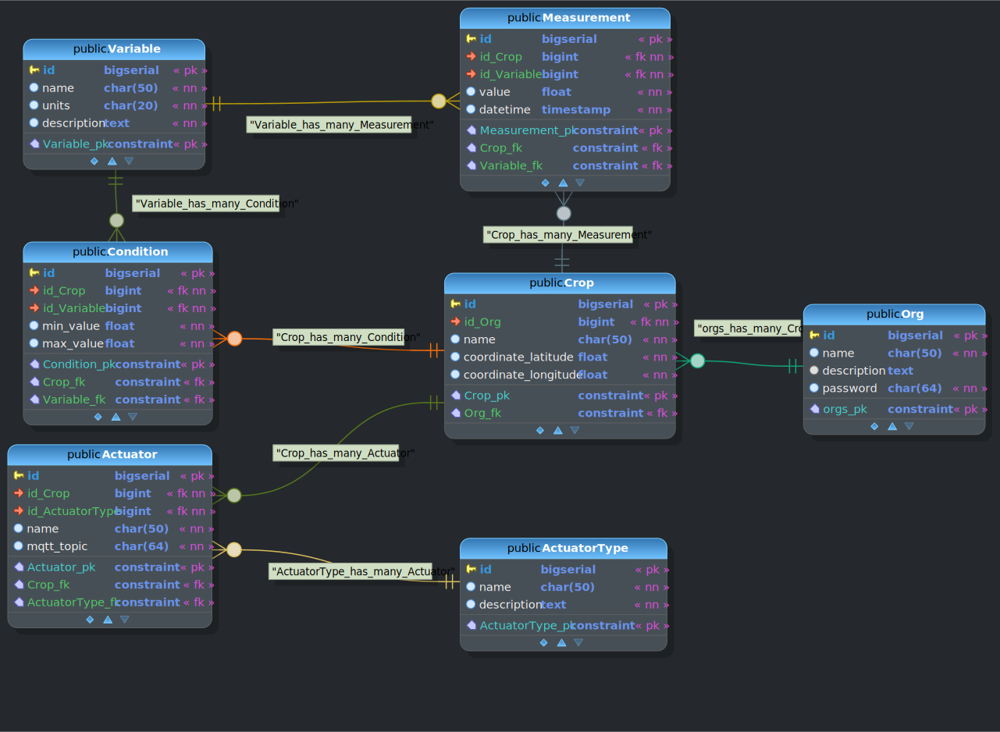

# Schema Structure

Here we define the database schema.

<figure>

<figcaption style="  background-color: black; color: white; font-style: italic; padding: 2px; text-align: center;">Database Schema with out Permission and User table.</figcaption>
</figure>

